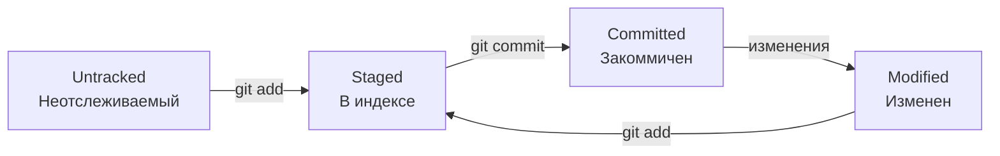

# Лекция по Git

## Что такое Git?

**Git** — это система контроля версий (VCS — Version Control System). Если объяснять просто: Git позволяет отслеживать изменения в файлах, возвращаться к предыдущим версиям, работать над проектом одновременно с другими людьми, не боясь потерять данные или "сломать" что-то важное.

Представь, что ты пишешь курсовую работу:
- Ты создаешь файл `kursovaya_v1.docx`
- Потом `kursovaya_v2.docx`
- Потом `kursovaya_final.docx`
- Потом `kursovaya_final_2.docx`
- Потом `kursovaya_absolutely_final.docx`

Знакомо? 😄 Git делает это автоматически и гораздо умнее.

## Зачем нужен Git?

1. **История изменений** — можно посмотреть, кто, когда и что изменил
2. **Откат к любой версии** — если что-то сломал, всегда можно вернуться назад
3. **Ветвление** — можно делать эксперименты в отдельной ветке, не трогая основной код
4. **Совместная работа** — несколько человек могут работать над одним проектом
5. **Бэкап** — код хранится не только на твоем компьютере

## Основные понятия

### Репозиторий (repository)
Это папка с проектом, за которой следит Git. Внутри этой папки Git создает скрытую папку `.git`, где хранит всю историю изменений.

### Коммит (commit)
"Снимок" состояния проекта в определенный момент времени. У каждого коммита есть:
- Уникальный идентификатор (хеш) — например, `c870799`
- Автор
- Дата
- Сообщение с описанием изменений ("commit message")

### Ветка (branch)
Отдельная линия разработки. По умолчанию всегда есть главная ветка — раньше она называлась `master`, сейчас чаще `main`.

### Удаленный репозиторий (remote)
Репозиторий, который находится не на твоем компьютере, а на сервере (например, на GitHub, GitLab, Bitbucket).

## Основной рабочий процесс

```
[Рабочая директория] → [Индекс (staging)] → [Локальный репозиторий] → [Удаленный репозиторий]
       │                        │                        │                        │
       │                        │                        │                        │
    git add                  git commit                git push                 
    (добавить               (закоммитить)            (отправить)
     в индекс)
       
       │                        │                        │
       │                        │                        │
    git status               git log                   git pull
    (проверить               (посмотреть               (забрать
     состояние)               историю)                  изменения)
```

### 1. Рабочая директория (Working Directory)
Твои файлы, с которыми ты работаешь. Git видит их, но не отслеживает изменения автоматически.

### 2. Индекс / Staging area
Промежуточная область, куда ты добавляешь файлы перед коммитом. Это как "корзина", в которую кладешь файлы, которые хочешь закоммитить.

```bash
git add файл.txt        # добавить конкретный файл
git add .               # добавить все изменения в текущей папке
git add -A              # добавить все изменения во всем проекте
```

### 3. Локальный репозиторий
Здесь хранятся все твои коммиты (история изменений).

```bash
git commit -m "Сообщение"   # создать коммит
```

### 4. Удаленный репозиторий
Репозиторий на сервере (GitHub), с которым можно синхронизироваться.

```bash
git push origin main        # отправить коммиты на сервер
git pull origin main        # забрать изменения с сервера
```

## Жизненный цикл файла в Git



## Самые частые команды (шпаргалка)

### Настройка
```bash
git config --global user.name "Твое Имя"
git config --global user.email "твой@email.com"
```

### Создание репозитория
```bash
git init                    # создать новый репозиторий
git clone <url>             # скопировать существующий
```

### Ежедневная работа
```bash
git status                  # посмотреть, что изменилось
git add <файлы>             # добавить в индекс
git commit -m "сообщение"   # создать коммит
git push                    # отправить на сервер
git pull                    # забрать с сервера
git log                     # посмотреть историю
```

### Ветки
```bash
git branch                  # список веток
git branch <имя>            # создать ветку
git checkout <ветка>        # переключиться на ветку
git checkout -b <ветка>     # создать и переключиться
git merge <ветка>           # слить ветку в текущую
```

## GitHub — что это?

GitHub — это веб-сервис для хранения Git-репозиториев. Это как "облако" для твоего кода. Плюс там есть куча дополнительных возможностей:
- **Pull requests** — предложения изменений
- **Issues** — трекер задач
- **Actions** — автоматизация (CI/CD)
- **Pages** — хостинг статических сайтов

## Типичный сценарий работы

### Начинаем новый проект:
```bash
# Создали папку, перешли в нее
mkdir my-project
cd my-project

# Инициализировали Git
git init

# Создали файлы
echo "# Мой проект" > README.md

# Добавили в Git
git add README.md
git commit -m "Initial commit"

# Связали с удаленным репозиторием
git remote add origin https://github.com/username/repo.git

# Отправили на GitHub
git push -u origin main
```

### Работаем над существующим проектом:
```bash
# Скопировали репозиторий
git clone https://github.com/username/repo.git
cd repo

# Создали новую ветку для фичи
git checkout -b new-feature

# Поработали, закоммитили
git add .
git commit -m "Add new feature"

# Отправили на GitHub
git push origin new-feature

# На GitHub создали Pull Request
# После проверки слили в main
```

## Важные концепции

### Коммиты — это не "сохранения"
Коммит должен быть **осмысленным**. Не коммить "исправил опечатку" вместе с "добавил новую функцию". Лучше разделить на два коммита.

### Частота коммитов
Чем чаще, тем лучше. Коммитить можно хоть каждые 5 минут. Это не "засорение истории", а твоя страховка.

### Сообщения коммитов
Пиши понятные сообщения:
- ❌ "fix"
- ❌ "asdf"
- ❌ "123"
- ✅ "Исправлена ошибка ввода email при регистрации"
- ✅ "Добавлена кнопка 'Загрузить файл'"

### Pull — это fetch + merge
`git pull` делает две вещи:
1. `git fetch` — скачивает изменения с сервера
2. `git merge` — сливает их с твоей веткой

## Конфликты (merge conflicts)

Иногда Git не может сам соединить изменения — это называется **конфликт**. Например, если два человека изменили одну и ту же строку файла.

Git помечает конфликтные места:
```text
<<<<<<< HEAD
твоя версия
=======
версия с сервера
>>>>>>> branch-name
```

Ты должен вручную выбрать, какой вариант оставить (или соединить оба), убрать маркеры `<<<<<<<`, `=======`, `>>>>>>>` и сделать коммит слияния.

## .gitignore

Файл `.gitignore` указывает, какие файлы Git должен игнорировать (не отслеживать и не добавлять в репозиторий). Обычно туда добавляют:
- Временные файлы (`.tmp`, `.log`)
- Папки с зависимостями (`node_modules/`, `vendor/`)
- Файлы с секретами (`.env`, пароли)
- Настройки IDE (`.idea/` для PyCharm)

Пример `.gitignore`:
```
# Python
__pycache__/
*.pyc
.env

# IDE
.idea/
.vscode/

# OS
.DS_Store
Thumbs.db
```

## Заключение

Git — это **must-have** для любого разработчика. Поначалу кажется сложным, но основные команды запоминаются очень быстро.

**Главное правило:** чем чаще делаешь коммиты, тем проще работать. Не бойся экспериментировать — всегда можно откатиться назад!

---

**Практическое задание:**
1. Создай новый репозиторий
2. Добавь файл README.md
3. Сделай коммит
4. Запушь на GitHub
5. Создай новую ветку
6. Измени что-нибудь
7. Слей ветки

В следующей лекции разберем работу с ветками подробнее и научимся разрешать конфликты.