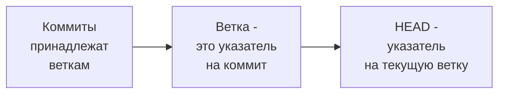

# Лекция 2: Работа с ветками и разрешение конфликтов

## Введение: Зачем нужны ветки?

Помнишь, в первой лекции мы говорили про курсовую работу и файлы `v1`, `v2`, `final`? Ветки в Git — это способ делать такие "версии" более организованно.

**Ветка (branch)** — это отдельная линия разработки. Представь, что ты пишешь книгу:
- Основная ветка (`main` или `master`) — это чистовой вариант
- Отдельные ветки — черновики, эксперименты, главы, которые ты пишешь параллельно

В разработке ветки используют для:
- Новых функций (feature branches)
- Исправления ошибок (hotfix branches)
- Экспериментов
- Работы разных разработчиков над проектом

## Базовые операции с ветками

### Просмотр веток
```bash
# Список локальных веток (* — текущая ветка)
git branch

# Список всех веток (включая удаленные)
git branch -a

# Посмотреть последние коммиты на ветках
git branch -v
```

### Создание веток
```bash
# Создать ветку (оставаясь в текущей)
git branch feature-login

# Создать и сразу переключиться
git checkout -b feature-login

# Современный синтаксис (Git 2.23+)
git switch -c feature-login
```

### Переключение между ветками
```bash
# Переключиться на существующую ветку
git checkout feature-login

# Современный синтаксис
git switch feature-login

# Вернуться на main/master
git checkout main
# или
git switch main
```

### Удаление веток
```bash
# Удалить ветку (если изменения уже влиты)
git branch -d feature-login

# Принудительно удалить (даже если не влито)
git branch -D feature-login

# Удалить ветку на удаленном репозитории
git push origin --delete feature-login
```

## Важное правило: где "живут" коммиты



Когда ты создаешь новую ветку, ты просто создаешь новый указатель на тот же коммит.

## Практический пример: Разработка новой функции

### Сценарий 1: Чистая работа

```bash
# Начинаем с главной ветки
git checkout main

# Создаем ветку для новой функции
git checkout -b add-pagination

# Работаем, делаем коммиты
echo "function paginate() { return true; }" > pagination.js
git add pagination.js
git commit -m "Add pagination function"

echo "// Тесты для пагинации" > pagination.test.js
git add pagination.test.js
git commit -m "Add pagination tests"

# Возвращаемся на main (там пока нет наших изменений)
git checkout main

# Сливаем изменения из ветки в main
git merge add-pagination

# Удаляем ветку (она больше не нужна)
git branch -d add-pagination
```

### Сценарий 2: Параллельная работа (конфликт)

```bash
# Допустим, два разработчика работают над одним файлом

# Разработчик А:
git checkout -b feature-a
# В файле index.html меняет строку 10 на: <title>Сайт (версия А)</title>
git add index.html
git commit -m "Change title to version A"

# Разработчик Б:
git checkout -b feature-b
# В файле index.html меняет ту же строку 10 на: <title>Сайт (версия Б)</title>
git add index.html
git commit -m "Change title to version B"

# Теперь пробуем слить feature-b в main (все ок, коммит просто добавился)
git checkout main
git merge feature-b  # Успешно

# А вот когда пробуем слить feature-a...
git merge feature-a
# КОНФЛИКТ! Git не знает, какое изменение принять
```

## Конфликты (Merge Conflicts)

### Как выглядит конфликт

Когда возникает конфликт, Git помечает проблемные места в файлах:

```html
<<<<<<< HEAD
<title>Сайт (версия Б)</title>
=======
<title>Сайт (версия А)</title>
>>>>>>> feature-a
```

**Что это значит:**
- `<<<<<<< HEAD` — начало твоих изменений (в текущей ветке)
- `=======` — разделитель между версиями
- `>>>>>>> feature-a` — конец изменений из вливаемой ветки

### Как разрешить конфликт

#### Способ 1: Вручную (через редактор)
1. Открыть файл с конфликтом
2. Выбрать, какой вариант оставить (или соединить оба)
3. Удалить маркеры `<<<<<<<`, `=======`, `>>>>>>>`
4. Сохранить файл

#### Способ 2: Через Git команды
```bash
# Если хочешь оставить свою версию
git checkout --ours index.html

# Если хочешь оставить версию из вливаемой ветки
git checkout --theirs index.html

# После выбора версии добавляем в индекс
git add index.html
```

#### Способ 3: Использовать инструменты слияния
```bash
# Открыть визуальный инструмент слияния
git mergetool
# (может открыть VSCode, KDiff3, Meld и т.д.)
```

### Завершение разрешения конфликта

После того как все конфликты разрешены:

```bash
# Добавляем разрешенные файлы
git add .

# Создаем коммит слияния
git commit -m "Merge feature-a: resolved conflict in index.html"

# Или просто
git merge --continue
```

## Стратегии слияния

### Fast-forward (перемотка)
Если ветки не расходились, Git просто передвигает указатель:
```bash
# Было: main → A, feature → A → B
git merge feature
# Стало: main → A → B (просто перемотали main на B)
```

### Recursive (рекурсивное)
Если ветки разошлись, Git создает коммит слияния:
```bash
# Было: main → A → C, feature → A → B
git merge feature
# Стало: main → A → C → M (M - коммит слияния)
#                  └──→ B ──┘
```

## Работа с удаленными ветками

### Отправка ветки на GitHub
```bash
# Отправить ветку и создать связь с удаленной
git push -u origin feature-login

# Теперь можно просто git push
git push
```

### Получение чужих веток
```bash
# Скачать информацию о всех удаленных ветках
git fetch origin

# Посмотреть удаленные ветки
git branch -r

# Создать локальную ветку из удаленной
git checkout -b feature-login origin/feature-login
# или коротко
git switch feature-login  # если ветка уже есть в origin
```

### Отслеживание веток (tracking branches)
Когда ветка связана с удаленной, можно использовать:
```bash
# Отправить изменения (в связанную ветку)
git push

# Забрать изменения (из связанной ветки)
git pull
```

## Rebasing (перебазирование)

**Внимание:** rebase переписывает историю! Использовать осторожно.

### Что такое rebase?
Вместо слияния (merge) можно "переставить" коммиты одной ветки на конец другой:

```bash
# Было:
# main: A → B
# feature: A → C → D

git checkout feature
git rebase main

# Стало:
# main: A → B
# feature: A → B → C → D
```

### Merge vs Rebase

**Merge:**
- ✅ Сохраняет реальную историю
- ✅ Понятно, когда что происходило
- ❌ Много коммитов слияния ("мусор" в истории)

**Rebase:**
- ✅ Чистая линейная история
- ✅ Легче читать
- ❌ Переписывает историю (опасно для общих веток)

### Золотое правило
> Никогда не делайте rebase на ветках, которые кто-то еще использует!

## Практические сценарии

### Сценарий 1: Начал работу, но main ушел вперед
```bash
# Ты работал в ветке feature
git checkout feature

# Забери изменения из main в твою ветку
git fetch origin
git rebase origin/main
# или
git merge origin/main

# Теперь твоя ветка содержит актуальные изменения
```

### Сценарий 2: Случайно закоммитил в main
```bash
# Ой, сделал коммит в main
git checkout -b hotfix  # создаем ветку с этим коммитом
git checkout main
git reset --hard HEAD~1  # откатываем main на 1 коммит назад
# Теперь коммит "живет" только в ветке hotfix
```

### Сценарий 3: Надо объединить несколько коммитов
```bash
# Интерактивный rebase
git rebase -i HEAD~3  # последние 3 коммита

# Откроется редактор:
pick a1b2c3 Первый коммит
pick d4e5f6 Второй коммит
pick g7h8i9 Третий коммит

# Меняем pick на squash для второго и третьего
pick a1b2c3 Первый коммит
squash d4e5f6 Второй коммит
squash g7h8i9 Третий коммит

# Получим один коммит вместо трех
```

## Stashing (прятать изменения)

Ситуация: ты работаешь, но срочно нужно переключиться на другую ветку, а коммитить рано.

```bash
# Спрятать текущие изменения
git stash

# Посмотреть список спрятанного
git stash list

# Вернуть последние спрятанные изменения
git stash pop

# Вернуть, но не удалять из stash
git stash apply

# Удалить из stash
git stash drop

# Спрятать с сообщением
git stash save "Работа над авторизацией"
```

## Типичные ошибки и их решение

### Ошибка 1: "fatal: refusing to merge unrelated histories"
```bash
# Когда пытаешься слить ветки с разной историей
git merge feature --allow-unrelated-histories
```

### Ошибка 2: Случайно удалил ветку
```bash
# Если помнишь хеш последнего коммита
git branch feature <хеш-коммита>

# Ищи в reflog
git reflog  # показывает все движения HEAD
```

### Ошибка 3: Конфликт при pull
```bash
# git pull выдал конфликт
# Можно отменить слияние
git merge --abort

# Или разрешить конфликт и продолжить
git add .
git merge --continue
```

## Workflow (Схемы работы с ветками)

### Git Flow (сложный, для больших проектов)
- `main` — только стабильный код
- `develop` — основная разработка
- `feature/*` — новые функции
- `release/*` — подготовка релизов
- `hotfix/*` — срочные исправления

### GitHub Flow (простой)
- `main` — всегда готов к деплою
- Ветки для фич
- Pull Request перед слиянием

### GitLab Flow (средний)
- `main` — основная ветка
- `environment` ветки (staging, production)
- Ветки для фич

## Pull Request (или Merge Request)

Это не Git-команда, а функция GitHub/GitLab:

1. Ты пушишь ветку с фичей
2. Идешь на сайт и создаешь Pull Request
3. Коллеги смотрят код, обсуждают
4. После одобрения — кнопка "Merge"
5. Ветка удаляется

```bash
# Процесс:
git checkout -b feature-awesome
# работаем...
git add .
git commit -m "Add awesome feature"
git push -u origin feature-awesome
# Идем на GitHub, создаем PR
# После мержа:
git checkout main
git pull
git branch -d feature-awesome
```

## Полезные алиасы для работы с ветками

```bash
git config --global alias.co checkout
git config --global alias.br branch
git config --global alias.st status
git config --global alias.lg "log --graph --pretty=format:'%Cred%h%Creset -%C(yellow)%d%Creset %s %Cgreen(%cr) %C(bold blue)<%an>%Creset' --abbrev-commit"
git config --global alias.ff "merge --ff-only"
git config --global alias.wip "commit -m 'WIP'"
```

Теперь можно смотреть красивый граф коммитов:
```bash
git lg
```

## Практическое задание

### Уровень 1: Базовые ветки
```bash
# 1. Создай новый репозиторий
mkdir git-practice
cd git-practice
git init

# 2. Создай файл и сделай несколько коммитов в main
echo "# Мой проект" > README.md
git add README.md
git commit -m "Initial commit"

echo "version 1" > file.txt
git add file.txt
git commit -m "Add file.txt v1"

# 3. Создай ветку и поработай в ней
git checkout -b feature
echo "version 2 (feature)" > file.txt
git add file.txt
git commit -m "Update file.txt in feature"

# 4. Вернись в main и измени тот же файл
git checkout main
echo "version 2 (main)" > file.txt
git add file.txt
git commit -m "Update file.txt in main"
```

### Уровень 2: Разрешение конфликта
```bash
# 5. Попробуй слить ветку feature в main
git merge feature
# Возникнет конфликт!

# 6. Разреши конфликт вручную
# Открой file.txt, выбери нужные изменения

# 7. Заверши слияние
git add file.txt
git commit -m "Merge feature: resolved conflict"
```

### Уровень 3: Работа с stash
```bash
# 8. Начни изменения в main
echo "незаконченная работа" >> file.txt

# 9. Срочно нужно переключиться на другую ветку
git stash

# 10. Переключись и потом верни изменения
git checkout -b hotfix
# сделай что-то...
git checkout main
git stash pop
```

## Шпаргалка по веткам

| Команда | Что делает |
|---------|------------|
| `git branch` | Показать ветки |
| `git branch <name>` | Создать ветку |
| `git checkout <name>` | Переключиться на ветку |
| `git checkout -b <name>` | Создать и переключиться |
| `git merge <name>` | Влить ветку в текущую |
| `git branch -d <name>` | Удалить ветку |
| `git push origin <name>` | Отправить ветку |
| `git fetch origin` | Скачать информацию о ветках |
| `git stash` | Спрятать изменения |
| `git stash pop` | Вернуть спрятанное |

## Заключение

Ветки — это суперсила Git. Они позволяют:
- Работать над несколькими задачами параллельно
- Экспериментировать без страха все сломать
- Работать в команде
- Делать код-ревью

Конфликты — это нормально! Не бойся их, практикуйся в разрешении. Чем чаще ты с ними сталкиваешься, тем легче их решать.

**В следующей лекции:** Работа с удаленными репозиториями и open source (как делать форки, контрибьютить в чужие проекты).